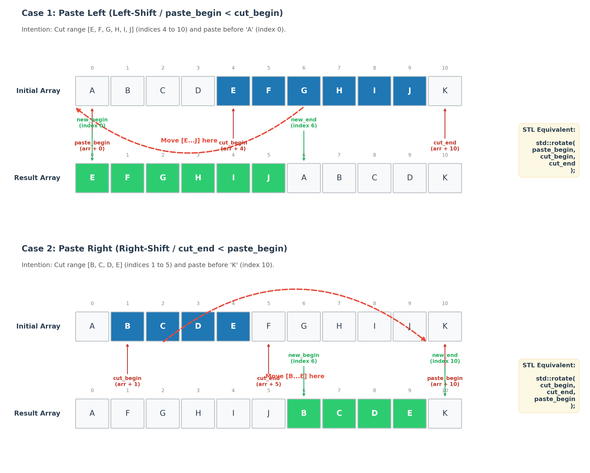

# cut_and_paste
## Synopsis

```cpp
template<class ForwardIt,
         class ForwardIts = std::pair<ForwardIt, ForwardIt>>
ForwardIts cut_and_paste(ForwardIt cut_begin,
                         ForwardIt cut_end,
                         ForwardIt paste_begin);
```

## Description
Moves the elements in the half-open range `[cut_begin, cut_end)` to the position specified by `paste_begin`. The operation is performed in place and preserves the relative order of both the moved elements and the elements that remain in the sequence.
If `paste_begin` precedes `cut_begin`, the cut range is moved before `paste_begin`. If `paste_begin` follows cut_end, the cut range is moved so that it ends immediately before `paste_begin`. If `paste_begin` is equal to `cut_begin` or `cut_end`, the sequence is not changed.
The operation is implemented using `std::rotate`.

## Parameters
`cut_begin` Iterator to the first element of the range to move.
`cut_end` Iterator past the last element of the range to move. The range to move is [cut_begin, cut_end).
`paste_begin` Iterator specifying the insertion position. The moved range is inserted before this position when it is outside the cut range.

## Return value 
A pair {new_begin, new_end} delimiting the moved range after the operation.
If `paste_begin` is equal to `cut_begin` or `cut_end`, the original pair `{cut_begin, cut_end}` is returned and the sequence is unchanged.
If the cut range is empty, no element is moved and the sequence remains unchanged.

## Type requirements
- All iterators must refer to the same sequence.
- ForwardIt must support relational comparison between iterators.
- The value type must satisfy the requirements of std::rotate: it must be move-constructible, move-assignable, and value-swappable.

## Complexity
Linear in the distance between the beginning and the end of the affected range. The operation performs at most a linear number of swaps, as required by std::rotate.

## Example
```cpp
#include <algorithm>
#include <vector>

std::vector<char> values{'A', 'B', 'C', 'D', 'E', 'F'};

auto cut_begin = values.begin() + 1; // 'B'
auto cut_end = values.begin() + 3;   // before 'D'
auto paste_begin = values.end();     // append before end()

auto [new_begin, new_end] =
    cut_and_paste(cut_begin, cut_end, paste_begin);

// values is now {'A', 'D', 'E', 'F', 'B', 'C'}.
// [new_begin, new_end) denotes {'B', 'C'}.
```

## Visual aids for better understanding



## Further informations
* [`std::rotate`](https://cppreference.com/cpp/algorithm/rotate)
* [If you see cut-paste, it is rotate](https://www.fluentcpp.com/2020/08/07/if-you-see-cut-paste-it-is-rotate/) by Jonathan Boccara

## Related links
[back to algorithm](../)

## Compilers
C++17 compliant

* [GCC 5.5.0](https://wandbox.org/)
* [clang 5.0.0](https://wandbox.org/)
* Microsoft (R) C/C++ Compiler 19.14 
