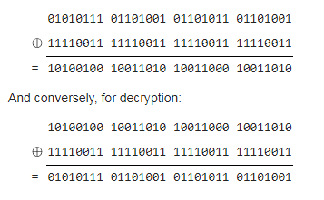

# XOR cipher
XOR encryption (or Exclusive-OR encryption) is a common method of encrypting data into a format that cannot be trivially cracked by the _average_ person but it can trivially be broken if a person knows cryptanalysis. The XOR operator is extremely common as a component in more complex ciphers. The current implementation of XOR cipher is STL-like algorithm that provides enormous variability of function calls by means overloaded function templates. 
### Basics
'Exclisive OR' is sometimes called modulus 2 addition (or subtraction, which is identical). With this logic, a string of text can be encrypted by applying the bitwise XOR operator to every character using a given key. To decrypt the output, merely reapplying the XOR function with the key will remove the cipher.   
[For example](https://en.wikipedia.org/wiki/XOR_cipher), the string "Wiki" (01010111 01101001 01101011 01101001 in 8-bit ASCII) can be encrypted with the repeating key 11110011 (number: 243) as follows:  
  
That is an equivalent to code:
```cpp
using bits8 = std::bitset<8>;

inline bits8 operator"" _bs ( const char* s ) {
    return bits8{s};
}

std::vector<bits8>  src = {01010111_bs, 01101001_bs, 01101011_bs, 01101001_bs};
const bits8    key = {11110011_bs};

simple_xor(src,key);
assert(src[0]==10100100_bs);
assert(src[1]==10011010_bs);
assert(src[2]==10011000_bs);
assert(src[3]==10011010_bs);

simple_xor(src,key);
assert(src[0]==01010111_bs);
assert(src[1]==01101001_bs);
assert(src[2]==01101011_bs);
assert(src[3]==01101001_bs);
```
If you would like to save encoded data into a separate destination you can write the following:  
```cpp
vector<char> out;
simple_xor("Wiki",'\243',back_inserter(out));
```
### Library
It's a header only library which contains set of overloaded 'simple_xor' and some metafunctions to support [Concept Lite](http://www.open-std.org/jtc1/sc22/wg21/docs/papers/2013/n3580.pdf).  
The pivotal 'simple_xor' is declared based on STL-compliant specification including (pseudo-) Concept Lite syntax constructions:
```cpp
template<typename InputIt, typename ForwardIt, typename OutputIt
   ,Requires(concepts::is_iterator_v<InputIt>)
   ,Requires(concepts::is_iterator_v<ForwardIt>)
   ,Requires(concepts::is_iterator_v<OutputIt>)
   >
OutputIt simple_xor(InputIt src_first, InputIt src_last, ForwardIt key_first, ForwardIt key_last, OutputIt d_first);
```
'simple_xor' applies the XOR function (exclusive disjunction operation) to a range [src_first, src_last) and stores the result in another range, beginning at d_first  
where  
- _\param_ [src_first, src_last) - a pair of iterators specifying the source range of elements to transform
- _\param_ [key_first, key_last) - a pair of iterators specifying the XOR encryption key
- _\param_ d_first - an iterator to the beginning of the destination range, may be equal to src_first
- _\return_ Output iterator to the element past the last element transformed, i.e. destination.end()  

In generic case 'simple_xor' can be parameterized various kinds of input and output  data including encoding key representation. Stated above it can be specified like this:  
- input  := {pair of iterators | C string literal | std\::string | std\::container | std\::stream }
- key    := {pair of iterators | C string literal | std\::string | std\::container | simple value}
- output := {pair of iterators | std\::string | std\::container | std\::stream }  

In addition to this combination of possible 'simple_xor' signatures (5\*5\*4=100 cases), an user is allowed to call it if _the input_ and _the output_ point out to the same data storage. 

### Examples
```cpp
   // encoding/decoding std::string
   string         origin  {"Wiki"};
   const string   key     {"key"};
   simple_xor(origin,key);
   assert(origin!="Wiki");
   simple_xor(origin,key,origin);        // an equivalent to simple_xor(origin,key);
   assert(origin=="Wiki");
```
```cpp
   // std::string is encoded to std::list with elements of 'unsigned' type 
   const string   origin  {"A program that has not been tested does not work. --Bjarne Stroustrup"};
   list<unsigned> out;
   simple_xor(origin,origin,back_inserter(out));
   assert(69==out.size());
   assert(all_of(out.begin(),out.end(),[](unsigned v){return 0==v;}));
```
```cpp
   // encoding/decoding file content
   simple_xor(ifstream{"main.cpp",ios::binary},"my secret word",ofstream{"main.encoded",ios::binary}); 
   simple_xor(ifstream{"main.encoded",ios::binary},"my secret word",ofstream{"main.decoded",ios::binary}); 
   using input_iterator = istreambuf_iterator<typename ifstream::char_type>;
   assert(equal
            ( input_iterator{ifstream{"main.cpp",ios::binary}}
             ,input_iterator{}
             ,input_iterator{ifstream{"main.decoded",ios::binary}}
            )
   );
```
## Further informations
* [XOR cipher](https://en.wikipedia.org/wiki/XOR_cipher)
* [Exclusive or](https://en.wikipedia.org/wiki/Exclusive_or)
* [Concepts Lite vs enable_if](https://akrzemi1.wordpress.com/2016/09/21/concepts-lite-vs-enable_if/) by Andrzej Krzemienski
* [std::void_t](https://www.youtube.com/watch?v=a0FliKwcwXE&feature=youtu.be&t=52m50s) Walter Brown's CppCon2014 talk on template metaprogramming

## Related links
* [compile time checks](../../iterator_traits2) for categories of iterators
* [Overloading by means std::enable_if](https://github.com/nikolaAV/Modern-Cpp/tree/master/concept%20(pceudo)/enable_if_overloading)
* [Modern C++ Detection Idiom](https://github.com/nikolaAV/Modern-Cpp/tree/master/concept%20(pceudo)/detection_idiom)
* [back to algorithm](../)

## Compilers
* [GCC 8.2.0](https://wandbox.org/)
* [clang 7.0.0](https://wandbox.org/)
* Microsoft (R) C/C++ Compiler 19.15 
