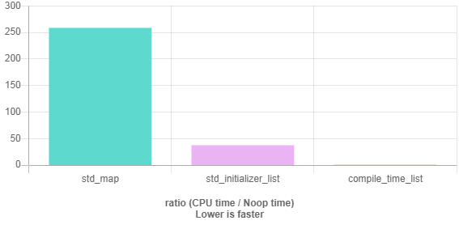

# Key/value storage at compile time as a list of types
Imagine there is some data known at compile time, two sets of integers representing API signals in separate and independent  
specifications.

Our goal is to make a bridge between these two worlds to be able to pass data from one to the another and vice verse.

Example of usage:
```cpp
using cmap = couple_list<
   kv<'1', 1>
   , kv<'2', 2>
   , kv<'3', 3>
   , kv<'4', 4>
   , kv<'5', 5>
   , kv<'6', 6>
>;

int main()
{
   std::cout << match<cmap>('3') << std::endl;
   std::cout << match<cmap>('7') << std::endl;
   std::cout << match<cmap>('8', 8) << std::endl;
   cin.get();
}
// output 
3
0
8
```
[Google benchmark](https://quick-bench.com/q/Kfw4IkbqsLvQck82-4OBaU7O31E) shows that searging over a compiler type list of key/value is 250 times faster than an equivalent solution based on `std::map`. 




## Further informations
TBD

## Related links
* [list of types](../../type_list)

[back to algorithm](../)

## Compilers
C++17 compliant only

* [GCC 5.5.0](https://wandbox.org/)
* [clang 5.0.0](https://wandbox.org/)
* Microsoft (R) C/C++ Compiler 19.14 
