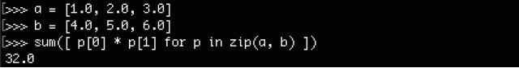

# zip iterator adapter

### Motivation
Different programming languages lead to different programming styles. 
This is, because there are different ways to express things, and they are differing in their elegance for each use case. 
That is no surprise because every language was designed with specific objectives.  
A very special kind of programming style is _purely functional programming_. 
It is magically different from the _imperative programming_ which C or C++ programmers are used to. 
While this style is very different, it enables extremely elegant code in many situations.  
One example of this elegance is the implementation of formulas, such as the mathematical [dot product](https://en.wikipedia.org/wiki/Dot_product). 
Given two mathematical vectors, applying the dot product to them means pairwise multiplying of the numbers at the same positions in the vector and then summing up all of those multiplied values. 
```cpp
// imperative style
std::vector<double> a {1.0, 2.0, 3.0};
std::vector<double> b {4.0, 5.0, 6.0};
double sum {0};
for (size_t i {0}; i < a.size(); ++i) {
   sum += a[i] * b[i];
} 
// sum = 32.0
```
How does it look like in those languages that can be considered _more elegant_?
_Haskell_ is a purely functional language, and this is how you can calculate the dot product of two vectors with a magical one-liner:  
  
_Python_ is not a purely functional language, but it supports similar patterns to some extent, as seen in the next example:  
  
Without delving into the explanations of such foreign syntax, an important commonality in both examples is the magical __zip__ function. 
What does it do? It takes the two vectors __a__ and __b__ and transforms them to a mixed vector. 
Example: __[a1, a2, a3]__ and __[b1, b2, b3]__ result in __[ (a1, b1), (a2,b2), (a3, b3) ]__ when they are zipped together.  
The relevant point is that it is now possible to iterate over _one_ combined range where pairwise multiplications can be done and then summed up to an accumulator variable. 
Exactly the same happens in the Haskell and Python examples, without adding any loop or index variable noise.  
It will not be possible to make the C++ code exactly as elegant and generic as in Haskell or Python, but this section explains how to implement similar magic using iterators, by implementing a __zip iterator__.  
```cpp
// functional style
std::vector<double> a {1.0, 2.0, 3.0};
std::vector<double> b {4.0, 5.0, 6.0};
auto sum = accumulate(zip::begin(a,b), zip::end(a,b),0.,[](auto s, auto v){
   return s + get<0>(v)*get<1>(v);
});
// sum = 32.0
```
### Specification 
__zip::iterator__ iterates over a range and gives a [`tuple`](https://en.cppreference.com/w/cpp/utility/tuple) of values from the tuple of specified containers as input at every iteration step. This means it iterates over all containers at the same time.  
> Note. If the input containers are not of equal length then overall zip range will have size of the minimal one.  
```cpp
template <typename... Ts>
class zip::iterator {
    explicit iterator(Ts... ts);
    std::tuple<Vals&...> operator*() const;
    iterator& operator++();
};
```
where
* Ts - type parameter pack is a content of variadic input iterator types 
* ts - argument pack contains any number of iterators that must meet the requirements of [LegacyInputIterator](https://en.cppreference.com/w/cpp/named_req/InputIterator).
* Vals - references to values that are pointed out by 'ts' iterators in order 

__zip::iterator__ has been made enough generic. It can combine any number of containers of any types. They may be lists and vectors or deques and maps even if these are specialized on completely different types.  
The free-standing __begin__ and __end__ functions provide an ability to get zip_iterators in a easy way.
```cpp
template <typename... Cs>
zip::iterator zip::begin(Cs&... cs);
template <typename... Cs>
zip::iterator zip::begin(zip::tuple<Cs&...> ts);

template <typename... Cs>
zip::iterator zip::end(Cs&... cs);
template <typename... Cs>
zip::iterator zip::end(zip::tuple<Cs&...> ts);
```
where
* Cs - type parameter pack is a content of variadic input container types 
* cs - argument pack contains any number of references to input containers.
* ts - an object of zip::tuple that contains any number of references to input containers.

### Example:
```cpp
auto l1 = initializer_list{ 'a','b','c','d','e','f' };
auto l2 = forward_list    { 'A','B','C','D','E','F' };
auto l3 = set             {  0,1,2,3,4,5 };
double l4[] =              { 4.,5.,6. };
for(auto [_1,_2,_3,_4] : zip::tuple{l1,l2,l3,l4}) {
   cout << _1 << ", " << _2 << ", " << _3 << ", " << _4 << endl;
}
// output: 
a, A, 0, 4
b, B, 1, 5
c, C, 2, 6
```
```cpp
template <typename T>
auto deep_swap(T& c1, T& c2) {
   for_each(zip::begin(c1,c2), zip::end(c1,c2), [](const auto& element) {
      std::swap(get<0>(element), get<1>(element));
   });
}

vector v1{ 0,1,2,3,4 };
vector v2{ 9,8,7,6,5 };

int& one = v1[1]; 
cout << v1[1] << " <-> " << one << endl;
deep_swap(v1,v2);
cout << v1[1] << " <-> " << one << endl;
// output: 
1 <-> 1
8 <-> 8
```
 
## Further informations
* [boost::zip_iterator](https://www.boost.org/doc/libs/1_41_0/libs/iterator/doc/zip_iterator.html)
* [C++17 STL Cookbook](https://books.google.com.ua/books?id=-nc5DwAAQBAJ&lpg=PA126&dq=zip%20iterator&pg=PA125#v=onepage&q=zip%20iterator&f=false)  by Jacek Galowicz

## Related links
* [unpacking_tuples](https://github.com/nikolaAV/Modern-Cpp/tree/master/tuple/unpacking_tuples)
* [variadic_indices](https://github.com/nikolaAV/Modern-Cpp/tree/master/variadic/variadic_indices)
* [cartesian product with lambdas as compile time](https://github.com/nikolaAV/Modern-Cpp/tree/master/lambda/lambda_cartesian)
* [back to algorithm](../)

## Compilers
* [GCC 8.1.0](https://wandbox.org/)
* [clang 7.0.0](https://wandbox.org/)
* Microsoft (R) C/C++ Compiler 19.16 
