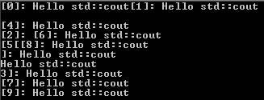
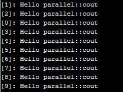

# Synchronizing concurrent std::cout use
One inconvenience in multithreaded programs is that we must practically secure every data structure they modify, with mutexes or other measures that protect from uncontrolled concurrent modification.
One data structure that is typically used very often for printing is `std::cout`.
If multiple threads access `cout` concurrently, then the output will appear in interesting mixed patterns on the terminal.
Example:
```cpp
void print(string s, size_t n) {
   std::cout << "[" << n << "]: " << s << endl; 
}

vector<thread> v;
for(size_t i{0}; i<10; ++i)
   v.emplace_back(print,"Hello std::cout",i);
for(auto& t:v) t.join();
```
output is  


The idea is that to create our own helper class 'parallel::cout' which publicly inherits from `std::stringstream`.
This way we can use `operator<<` on instances of it. And its destructor automatically serializes concurrent printing attempts.
```cpp
namespace parallel
{
   class cout : public std::stringstream {
      inline static std::mutex m_;
   public:
      ~cout() {
         std::lock_guard<std::mutex> lock{m_};
         std::cout << rdbuf();
      }
   };
}  // end namespace parallel
```
Thus, the example above can be rewritten with minimal changes
```cpp
void print(string s, size_t n) {
   parallel::cout{} << "[" << n << "]: " << s << endl; 
}
```
that produces output  



## Further informations
* [C++17 STL Cookbook](https://www.packtpub.com/application-development/c17-stl-cookbook), Jacek Galowicz, page 505  

## Related links
* TBD

## Compilers
* [GCC 8.1.0](https://wandbox.org/)
* [clang 7.1.0](https://wandbox.org/)
* Microsoft (R) C/C++ Compiler 19.16 
