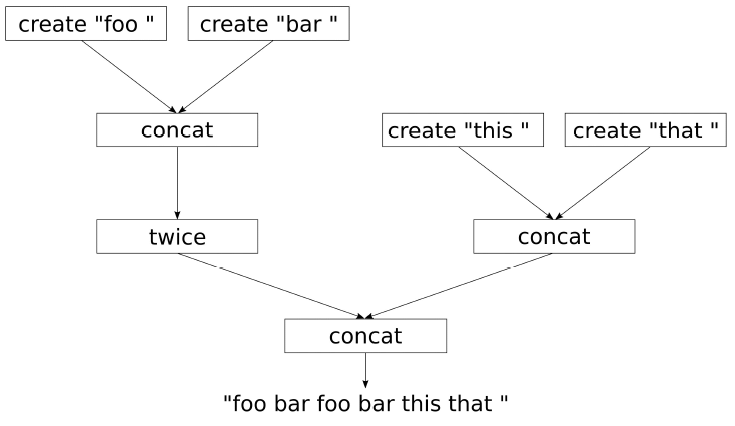
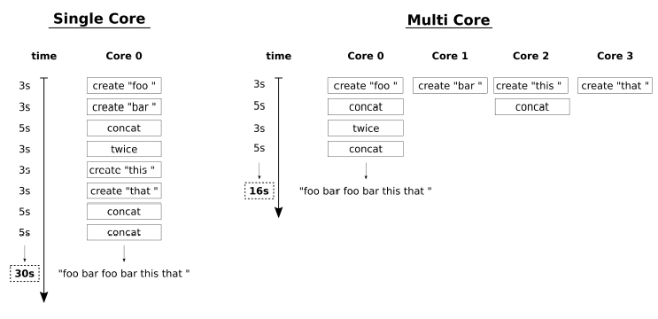

# Header library that enables explicit task-based parallelism in a sequential C++ code
Most complex tasks can be broken down into subtasks. Even more, these all subtasks may be compound in the [Direct Acyclic Grapf (DAG)](https://en.wikipedia.org/wiki/Directed_acyclic_graph) that describes which subtask depenrs on what other subtasks in order to finish the higher level task.
Let's imagine that we want to produce the string "foo bar foo bar this that ", and we can only do this by creating single words and concatenate those with other words, or with themselves.
Let's say this functionality is provided by three primitive functions _'create'_, _'concat'_, and _'twice'_.
Based on that, DAG can be shown as


Where our primitive functions can be
```cpp
string create(string_view s) { 
   // <--- costs 3 secs 
   this_thread::sleep_for(3s);
   return {cbegin(s),cend(s)};
}

string concat(const string& s1, const string& s2) {
   // <--- costs 5 secs
   this_thread::sleep_for(5s);
   return s1+s2;
}

string twice(const string& s) {
   // <--- costs 3 secs
   this_thread::sleep_for(3s);
   return s+s;
}
```
When implementing this in code, it is clear that everything can be implemented in a serial manner on one CPU core.
```cpp
// sequential version
/*
   auto a   = create("foo ");
   auto b   = create("bar ");
   auto c   = concat(a, b);
   auto d   = twice(c);
   auto e   = create("this ");
   auto f   = create("that ");
   auto g   = concat(e, f);
   auto res = concat(d, g);
*/
   const auto res = 
      concat(
         twice(
            concat(
               create("foo "),
               create("bar ")
            )
         ),
         concat(
            create("this "),
            create("that ")
         )
      );
   return res;
```
Alternatively, all subtasks that depend on no other subtasks or other subtasks that already have been finished, can be executed concurrently on multiple CPU cores.
Proposed here a little library (it only contains 3 functions) which uses [std::async](https://en.cppreference.com/w/cpp/thread/async) helps to transform the normal functions _'create'_, _'concat'_, and _'twice'_ to functions that work asynchronously.
During execution, the graph will parallelize itself in a seemingly intelligent way in order to calculate the result as fast as possible. 
```cpp
// parallel version
   using namespace pdag;

   // First of all, 
   // let's take the functions create, concat, and twice and make them asynchronous.
   auto pcreate = asynchronize(create); 
   auto pconcat = async_adapter(concat); 
   auto ptwice  = async_adapter(twice); 

   // and rewrite the previous sequential version
   const auto res = 
      pconcat(
         ptwice(
            pconcat(
               pcreate("foo "),
               pcreate("bar ")
            )
         ),
         pconcat(
            pcreate("this "),
            pcreate("that ")
         )
      );
   return res().get();
```
Finally, let's have a look at two example schedules of execution of the parallel version


On the left side, we see a single core schedule (it's equivalent to the sequential version). All the function calls have to be done one after each other because we have only a single CPU. That means, that when _'create'_ costs 3 seconds, _'concat'_ costs 5 seconds and _'twice'_ costs 3 seconds, it will take 30 seconds to get the end result.
On the right side, we see a parallel schedule where as much is done in parallel as the dependencies between the function calls allow. In an ideal world with four cores, we can create all substrings at the same time, then concatenate them and so on. The minimal time to get the result with an optimal parallel schedule is 16 seconds. We cannot go faster if we cannot make the function calls themselves faster. With just four CPU cores we can achieve this execution time. We measurably achieved the optimal schedule!!!

## Further informations
* [Expert C++ Programming](https://books.google.com.ua/books?id=bqdWDwAAQBAJ&pg=PA937&lpg=PA937&dq=Implementing+a+tiny+automatic+parallelization+library+with+std::future&source=bl&ots=MGBb6X4tGm&sig=z2MwUXqwbuBaRSWa5N2F9br_Yn0&hl=en&sa=X&ved=0ahUKEwjfpuDM15vcAhURK3wKHVTeAjUQ6AEIKzAB#v=onepage&q&f=false) by By Maya Posch, Jacek Galowicz

## Related links
* [C++17 currying with nested lambda exression](https://github.com/nikolaAV/Modern-Cpp/tree/master/lambda/lambda_currying)

## Compilers
* [GCC 8.1.0](https://wandbox.org/)
* [clang 6.0.0](https://wandbox.org/)
* Visual C++ 19.14 
